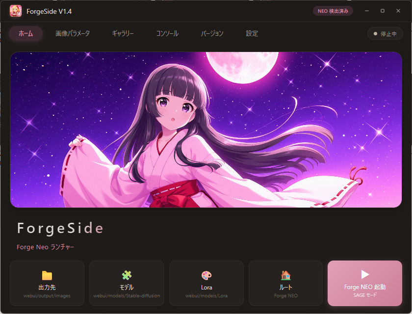
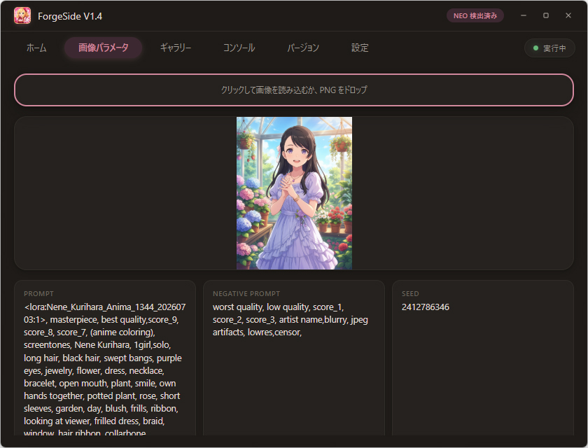
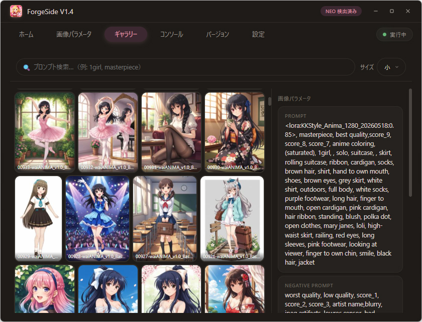
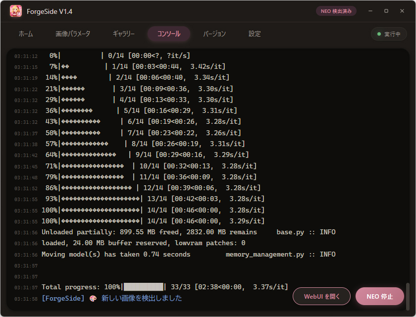
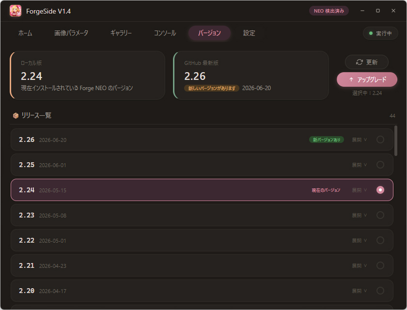
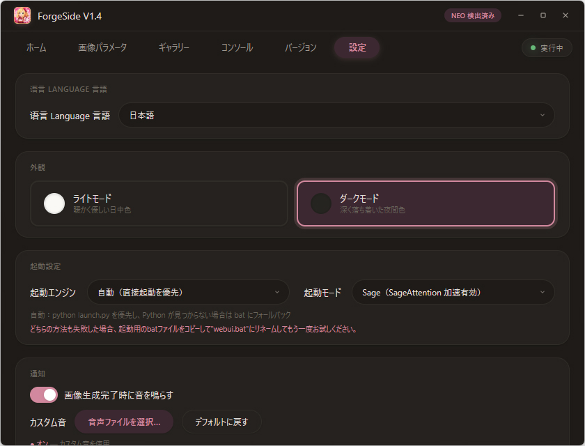
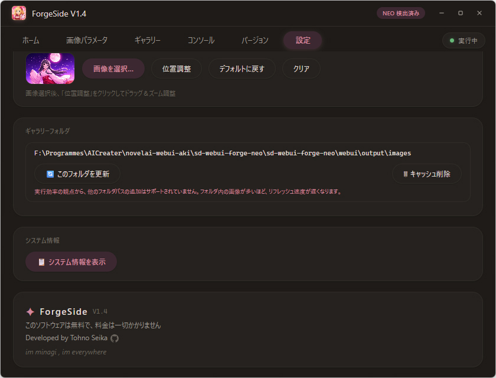

[🌏 English](README.md) | [简体中文](README.zh-CN.md) | [繁體中文](README.zh-TW.md) | **日本語**

---

# ForgeSide ✨

> Forge NEO ランチャー——美しく、軽快で、使いやすく。

[Forge NEO](https://github.com/Haoming02/sd-webui-forge-classic/) の Windows 用ランチャーです。グラフィカルなインターフェースで Forge NEO の管理と起動をサポートします。コンソール出力、画像パラメータ解析、ギャラリー閲覧、バージョン管理などの機能を備えています。[公式 Forge NEO](https://github.com/Haoming02/sd-webui-forge-classic/) に対応し、それをベースにしたサードパーティ統合パックも理論上サポートしています。

<p style="color:#d2889e;">
本ソフトウェアは現在、簡体字中国語・繁体字中国語・英語・日本語の4言語に対応しています。
</p>

---

<p style="color:#d2889e;">
ForgeSideは<a href="https://github.com/Haoming02/sd-webui-forge-classic/">Forge NEO</a>の起動と管理のみをサポートしています。ComfyUI、Forge、SD WebUI A1111、Fooocusはサポートしていません。
</p>

---

## ✨ 機能

- **ワンクリック起動** — コマンド入力不要、クリックするだけ
- **3つの起動モード** — SDP（互換性優先、加速無効）、Sage（SageAttention 加速有効）、標準（webui.bat を起動）
- **内蔵起動ロジック** — 外部スクリプト不要
- **プロセス保護** — NEO 実行中の誤終了を防止する確認ダイアログ

- Forge NEO の出力をリアルタイムでキャプチャして表示
- エラー（Error / Traceback / CUDA OOM）は赤、警告は黄、情報は青で強調表示
- 実行中はいつでも「NEO 停止」または「WebUI を開く」をワンクリック

- WebUI / Forge / ComfyUI で生成された PNG 画像を読み込み
- Prompt、Negative Prompt、Seed、Steps、CFG Scale、Sampler、Model、解像度などを自動解析
- クリック読み込み、ファイルドラッグ＆ドロップ、base64 ドラッグ＆ドロップに対応
- 各パラメータにコピーボタン付き

- Forge NEO の出力ディレクトリから PNG 画像を自動スキャン
- 3段階のサムネイルサイズ（小/中/大）、非同期でバックグラウンド生成
- 複数タグ検索（カンマ区切り、順序不問）
- ダブルクリックでデフォルトビューアで画像を開く
- ギャラリーから外部（フォルダ、エディタなど）への画像ドラッグに対応
- ギャラリーのパスは Forge NEO の出力ディレクトリに固定

- ピンク基調の優しいインターフェース、ワンクリックでライト/ダークテーマ切替
- ボーダーレスカスタムウィンドウ、ドラッグ移動、サイズ変更、最大化/復元に対応
- ホームバナー上での桜エフェクト（Canvas）
- 角丸ウィンドウ、スムーズなアニメーション

- ローカルの Forge NEO バージョンを自動検出し、GitHub から最新リリース情報を取得
- リリース履歴と更新内容を表示
- 指定バージョンへのアップグレード/切替/ロールバックをワンクリック（Git tag）
- サードパーティパック（`webui/` ディレクトリ）と[公式 GitHub 版](https://github.com/Haoming02/sd-webui-forge-classic/)の両方に対応

- HTTP プロキシ設定（ON/OFF 切替、カスタムアドレス）
- Google と Hugging Face の接続テストをワンクリック

- 画像生成完了時に自動再生
- カスタムサウンドファイル対応（.mp3 / .wav / .ogg / .flac 等）
- システムデフォルトサウンドに戻すオプション

- ワンクリックでハードウェア構成を表示
- Python バージョンと Forge NEO バージョンを自動検出

- ホームバナーにカスタム背景画像を設定可能
- ビジュアルポジションエディター：ドラッグで移動、ホイールでズーム、十字線が中心をマーク

---

## 🖼 スクリーンショット


*ホーム — 起動エントリ、クイックフォルダ、背景画像*


*画像パラメータ — PNG をドロップして自動解析*


*ギャラリー — サムネイル閲覧、マルチタグ検索*


*コンソール — リアルタイム出力、NEO 起動/停止*


*バージョン管理 — リリース履歴、ワンクリックアップグレード*


*設定 — テーマ、起動モード、プロキシ、通知音など*


*About — バージョン情報、著作権*

---

## 📦 ダウンロード


[Releases](https://github.com/TohnoSeika/ForgeSide/releases) ページから最新バージョンをダウンロードしてください。


1. **OS**：Windows 10 および Windows 11（64bit）のみ対応
   - Windows 7 / 8 / 8.1、Linux、macOS は非対応
2. **.NET 10 Desktop Runtime**（必須）
   - ダウンロード：https://dotnet.microsoft.com/download/dotnet/10.0
3. **WebView2 ランタイム**（UI 描画に必要）
   - Windows 11 は標準搭載
   - Windows 10 は手動インストールが必要な場合あり
   - ダウンロード：https://developer.microsoft.com/ja-jp/microsoft-edge/webview2/


1. .NET 10 Desktop Runtime をインストール（未インストールの場合）
2. `ForgeSide` フォルダを Forge NEO のルートディレクトリに展開：

   **[公式版](https://github.com/Haoming02/sd-webui-forge-classic/)：**
   ```
   sd-webui-forge-neo/
   ├── models/
   ├── outputs/
   ├── webui.bat
   ├── webui-user.bat
   ├── ...（その他ファイル）
   └── ForgeSide/          ← ここに展開
       ├── ForgeSide.exe
       ├── forge_side_ui.html
       └── ...（その他ファイル）
   ```

   **サードパーティ統合パックの参考構成：**
   ```
   sd-webui-forge-neo/
   ├── webui/
   ├── ...（その他ファイル）
   └── ForgeSide/          ← ここに展開
       ├── ForgeSide.exe
       ├── forge_side_ui.html
       └── ...（その他ファイル）
   ```

3. `ForgeSide.exe` をダブルクリックして起動


## 📋 更新履歴


- 🐛 コンソールの文字化けを修正
- ⚡ WebUI 起動ロジックを最適化
- 🌍 簡体字中国語・繁体字中国語・英語・日本語の4言語に対応


- 🏗️ [公式 Forge NEO](https://github.com/Haoming02/sd-webui-forge-classic/) に対応
- 📦 GitHub からバージョン管理（表示、アップグレード、切替）に対応
- 🔒 ギャラリーのパスを Forge NEO 出力フォルダに固定
- 🖼️ 画像ダブルクリックでデフォルトビューアを起動
- 🖱️ ギャラリーから外部への画像ドラッグに対応
- 🔍 マルチタグ検索を最適化
- ⚡ 起動ロジックを ForgeSide に内蔵
- 🌐 プロキシ接続テスト（Google / Hugging Face）を追加


- 🪟 ウィンドウのサイズ変更と最大化に対応
- 📋 ハードウェア情報表示（CPU / GPU / RAM / ディスク / 画面）を追加
- 🗂️ ギャラリー機能を追加


- 🔒 NEO 実行中の終了確認ダイアログを追加
- 🐛 サードパーティファイルマネージャー（XYplorer）の問題を修正
- 🐛 タスクバークリックで最小化しない問題を修正
- 🌸 ホームバナーに桜エフェクトを追加
- 🐛 背景位置のエディタと実際の表示の不一致を修正
- 🎵 カスタム通知音とファイルパス表示を追加


- 🎉 初回リリース

---

## 🤖 AI 支援に関する声明

本プロジェクトのコードおよび UI デザインの一部は AI の支援を受けて作成されています。

---

## 📜 ライセンス

本プロジェクトは**フリーソフトウェア**です。すべての権利は留保されます。  
詳細は [LICENSE](./LICENSE) ファイルをご覧ください。

---

> このソフトウェアは無料であり、料金を請求することはありません。  
> Developed by Tohno Seika · [Bilibili](https://space.bilibili.com/14816) · [GitHub](https://github.com/TohnoSeika)
