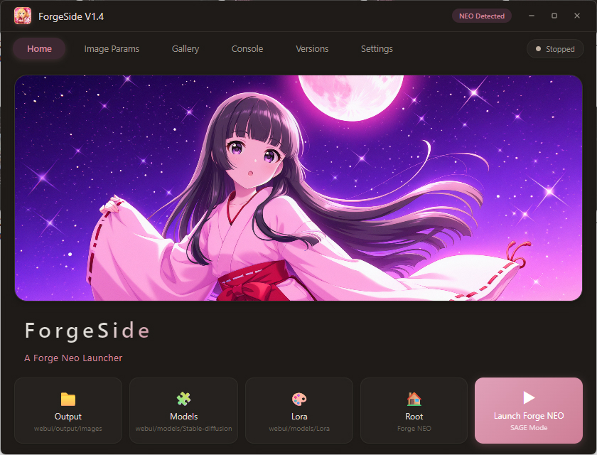
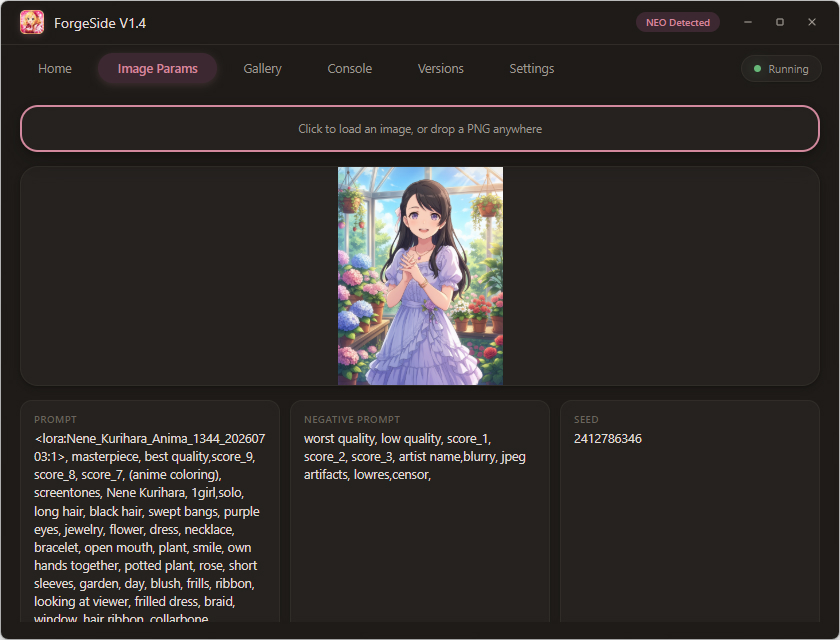
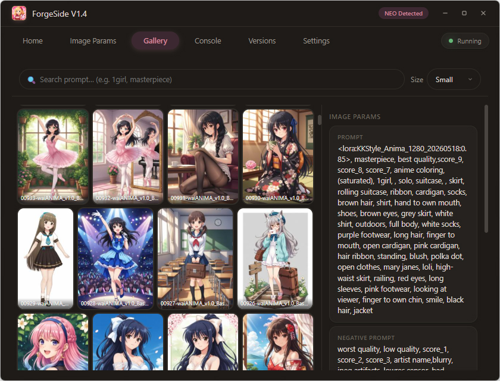
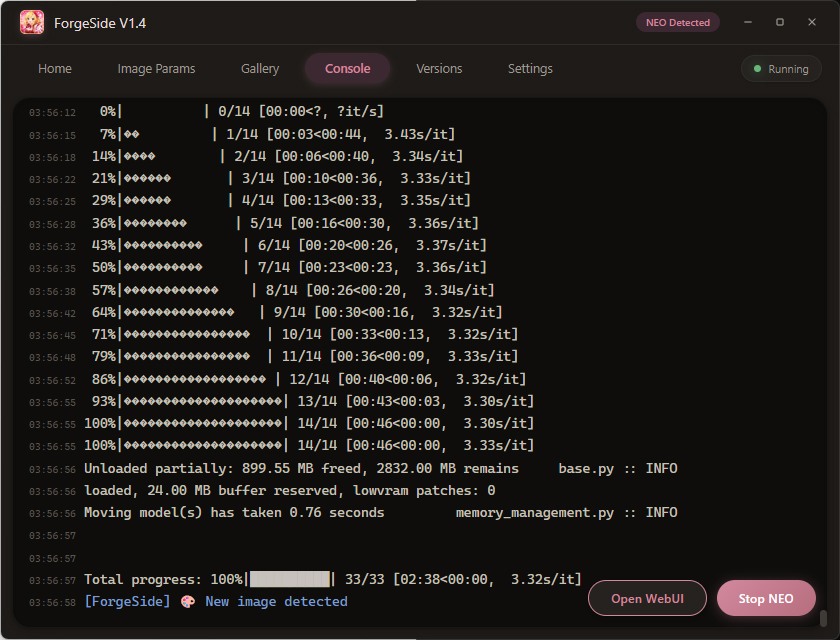
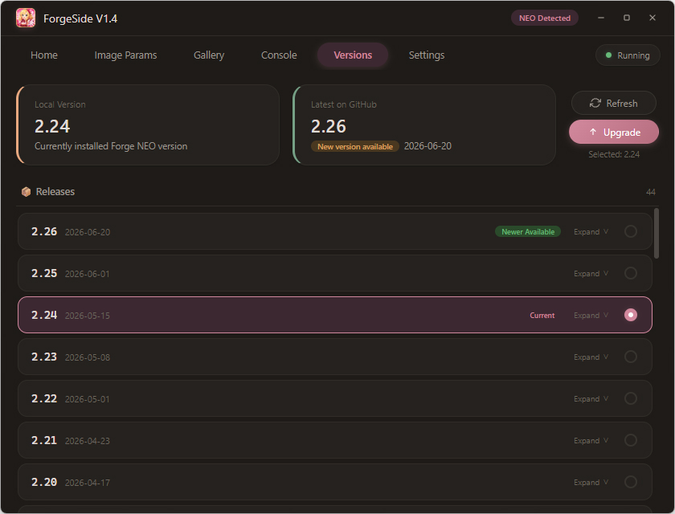
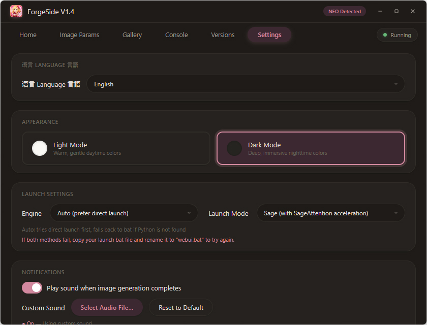
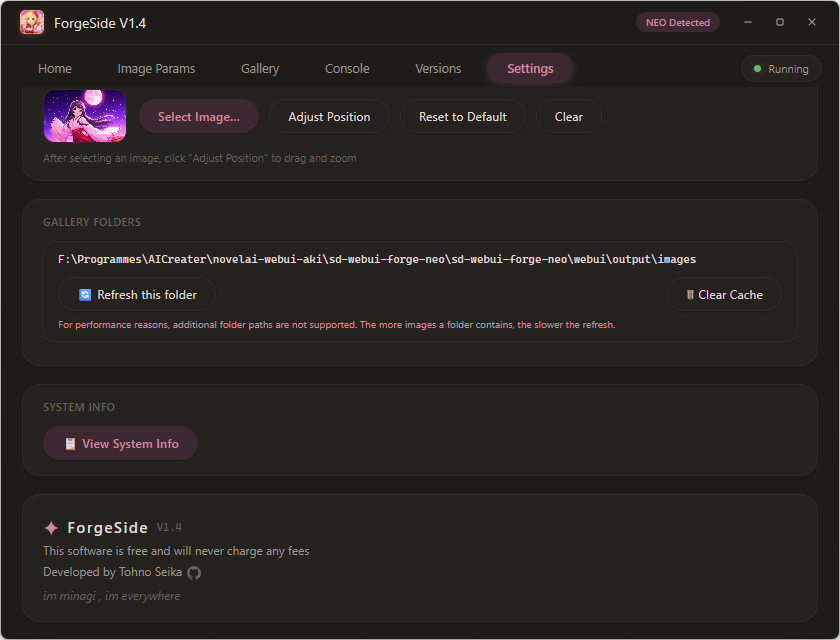

[🌏 **English**](README.md) | [简体中文](README.zh-CN.md) | [繁體中文](README.zh-TW.md) | [日本語](README.ja.md)

---

# ForgeSide ✨

> A Forge NEO launcher — beautiful, lightweight, and handy.

A Windows launcher for [Forge NEO](https://github.com/Haoming02/sd-webui-forge-classic/), providing a graphical interface to manage and launch Forge NEO. Features include a live console, image parameter parsing, gallery browsing, version management, and more. Supports the [official Forge NEO](https://github.com/Haoming02/sd-webui-forge-classic/), and theoretically any third-party packs based on it.

<p style="color:#d2889e;">
This software currently supports Simplified Chinese, Traditional Chinese, English, and Japanese.
</p>

---

<p style="color:#d2889e;">
ForgeSide only supports launching and managing <a href="https://github.com/Haoming02/sd-webui-forge-classic/">Forge NEO</a>. It does not support ComfyUI, Forge, SD WebUI A1111, or Fooocus.
</p>

---

## ✨ Features

### 🚀 Launch & Management
- **One-click launch** — no need to type commands, just click to start
- **Three launch modes** — SDP (compatibility, no acceleration), Sage (with SageAttention acceleration), Standard (launches webui.bat only)
- **Built-in launch logic** — no external scripts required
- **Process protection** — confirmation dialog prevents accidental closure while NEO is running

### 🖥️ Live Console
- Captures Forge NEO output in real-time, displayed in the console panel
- Errors (Error / Traceback / CUDA OOM) highlighted in red, warnings in yellow, info in blue
- One-click "Stop NEO" or "Open WebUI" while running

### 🖼️ Image Parameter Reader
- Load a PNG generated by WebUI / Forge / ComfyUI
- Automatically parses and displays: Prompt, Negative Prompt, Seed, Steps, CFG Scale, Sampler, Model, resolution, and more
- Supports click-to-load, drag-and-drop files, and drag-and-drop base64
- Copy button on each parameter for quick copying

### 🗂️ Gallery Browser
- Automatically scans Forge NEO output directory for PNG images
- Three thumbnail sizes (small/medium/large), generated asynchronously in the background
- Multi-tag search (comma-separated, order-independent)
- Double-click to open in default image viewer
- Drag images out of the gallery to external locations (folders, editors)
- Gallery path locked to Forge NEO output directory

### 🎨 Visual & Interaction
- Pink-toned gentle interface with one-click light/dark theme switching
- Borderless custom window with drag, resize, and maximize/restore support
- Sakura petal Canvas effect on the home banner
- Rounded corners, smooth animations, elegant transitions

### 📦 Version Management
- Auto-detects local Forge NEO version and fetches latest release info from GitHub
- View release history and changelogs
- One-click upgrade, switch, or rollback to a specific version (via Git tags)
- Supports both third-party packs (with `webui/` directory) and the [official GitHub version](https://github.com/Haoming02/sd-webui-forge-classic/)

### 🌐 Proxy Support
- Built-in HTTP proxy settings with toggle and custom address
- One-click connectivity test for Google and Hugging Face

### 🎵 Notification Sound
- Auto-plays a sound when image generation completes
- Supports custom sound files (.mp3 / .wav / .ogg / .flac, etc.)
- Option to reset to the system default sound

### 📋 System Info
- One-click view of full hardware configuration
- Auto-detects Python version and Forge NEO version

### 🖼️ Custom Background
- Home banner supports a custom background image
- Visual position editor: drag to move, scroll to zoom, crosshair marks center

---

## 🖼 Screenshots


*Home — launch entry, quick folders, background image*


*Image Params — drag in a PNG for automatic parsing*


*Gallery — thumbnail browsing, multi-tag search*


*Console — real-time output, start/stop NEO*


*Version Management — release history, one-click upgrade*


*Settings — theme, launch mode, proxy, sound, and more*


*About — version info, copyright*

---

## 📦 Download

Download the latest release from the [Releases](https://github.com/TohnoSeika/ForgeSide/releases) page.

### System Requirements

1. **OS**: Windows 10 and Windows 11 (64-bit) only
   - Windows 7 / 8 / 8.1, Linux, and macOS are not supported
2. **.NET 10 Desktop Runtime** (required)
   - Download: https://dotnet.microsoft.com/download/dotnet/10.0
3. **WebView2 Runtime** (for rendering the UI)
   - Built into Windows 11
   - Windows 10 may require manual installation
   - Download: https://developer.microsoft.com/en-us/microsoft-edge/webview2/

### Installation

1. Install .NET 10 Desktop Runtime (if not already installed)
2. Extract the `ForgeSide` folder into your Forge NEO root directory:

   **[Official version](https://github.com/Haoming02/sd-webui-forge-classic/):**
   ```
   sd-webui-forge-neo/
   ├── models/
   ├── outputs/
   ├── webui.bat
   ├── webui-user.bat
   ├── ... (other files)
   └── ForgeSide/          ← extract here
       ├── ForgeSide.exe
       ├── forge_side_ui.html
       └── ... (other files)
   ```

   **Third-party pack reference structure:**
   ```
   sd-webui-forge-neo/
   ├── webui/
   ├── ... (other files)
   └── ForgeSide/          ← extract here
       ├── ForgeSide.exe
       ├── forge_side_ui.html
       └── ... (other files)
   ```

3. Double-click `ForgeSide.exe` to launch


## 📋 Changelog

### V1.4

- 🐛 Fixed garbled text in the console
- ⚡ Optimized WebUI launch logic
- 🌍 Added UI language support: Simplified Chinese, Traditional Chinese, English, and Japanese

### V1.3 (Chinese only)

- 🏗️ Added support for [official Forge NEO](https://github.com/Haoming02/sd-webui-forge-classic/)
- 📦 Added version management — view, upgrade, and switch Forge NEO versions from GitHub
- 🔒 Gallery path locked to Forge NEO output folder
- 🖼️ Double-click to open images in default viewer
- 🖱️ Drag images out of the gallery
- 🔍 Improved multi-tag search (comma-separated, order-independent)
- ⚡ Launch logic built into ForgeSide
- 🌐 Added proxy connection test (Google / Hugging Face)
- 🖤 Added GitHub icon link in the about section

### V1.2 (Chinese only)

- 🪟 Resizable window with maximize support
- 📋 Added hardware info display (CPU / GPU / RAM / Disk / Display)
- 🗂️ Added gallery (thumbnail cache, search, browse)

### V1.1 (Chinese only)

- 🔒 Added close confirmation while NEO is running
- 🐛 Fixed third-party file manager (XYplorer) not working
- 🐛 Fixed minimize issue when clicking taskbar icon
- 🌸 Added sakura petal Canvas effect on home banner
- 🐛 Fixed background position mismatch between editor and actual display
- 🎵 Added custom notification sound with file path display

### V1.0 (Chinese only)

- 🎉 Initial release

---

## 🤖 AI Assistance Statement

Parts of this project's code and UI design were created with AI assistance.

---

## 📜 License

This project is **free software**, all rights reserved.  
See [LICENSE](./LICENSE) for details.

---

> This software is free and will never charge any fees.  
> Developed by Tohno Seika · [Bilibili](https://space.bilibili.com/14816) · [GitHub](https://github.com/TohnoSeika)
