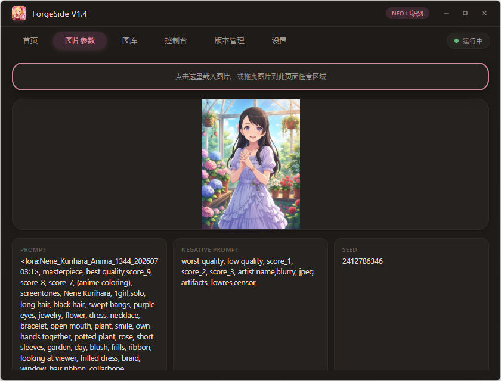
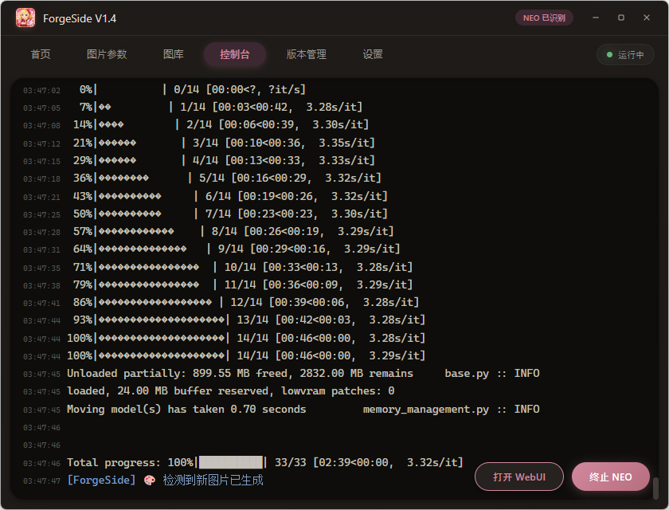
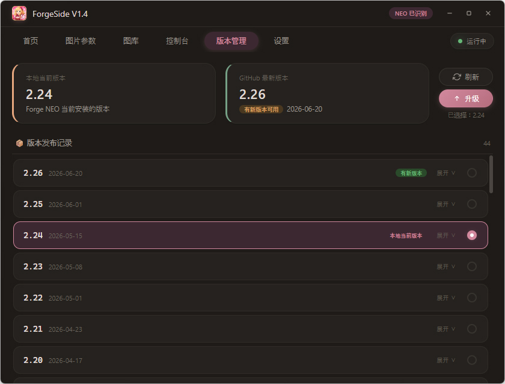
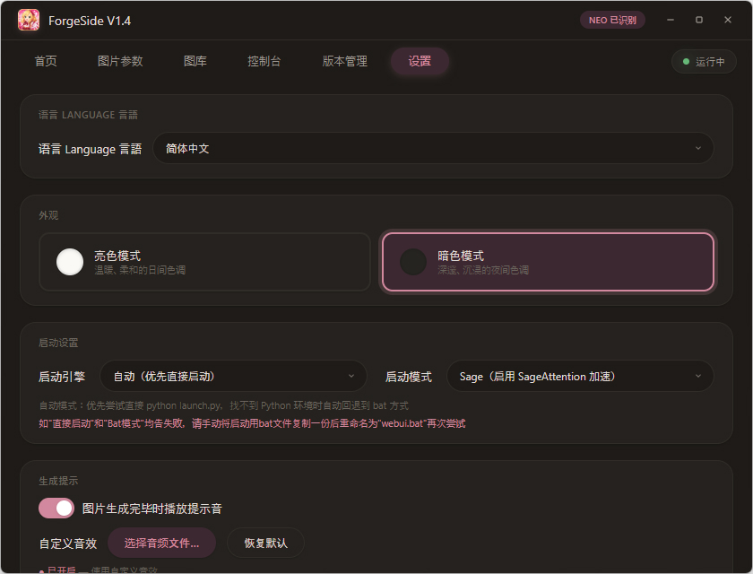
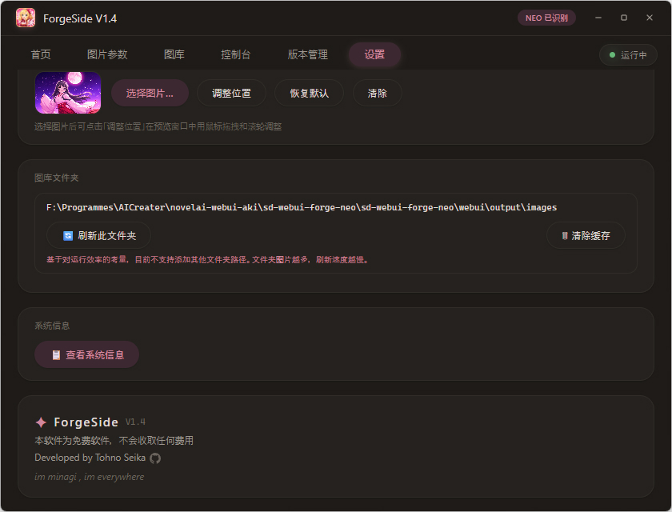

[🌏 English](README.md) | **简体中文** | [繁體中文](README.zh-TW.md) | [日本語](README.ja.md)

---

# ForgeSide ✨

> Forge NEO 的辅助启动工具——漂亮、轻巧、顺手。

一个 Windows 端 [Forge NEO](https://github.com/Haoming02/sd-webui-forge-classic/) 启动器，提供图形化界面来管理和启动 Forge NEO，包含控制台输出、图片参数解析、图库浏览、版本管理等功能。支持[官方版 Forge NEO](https://github.com/Haoming02/sd-webui-forge-classic/)，理论上也支持基于[官方版 Forge NEO](https://github.com/Haoming02/sd-webui-forge-classic/)的第三方整合包。

<p style="color:#d2889e;">
本软件目前支持 简体中文・繁体中文・English・日本語 四种界面语言。
</p>

---

<p style="color:#d2889e;">
ForgeSide 仅支持启动和管理 <a href="https://github.com/Haoming02/sd-webui-forge-classic/">Forge NEO</a>，不支持 ComfyUI / Forge / SD WebUI A1111 / Fooocus
</p>

---

## ✨ 特性

### 🚀 启动与管理
- **一键启动 Forge NEO** —— 无需手动敲命令，点击即可启动
- **三种启动模式** —— 支持 SDP 模式（兼容性优先，禁用加速）、Sage 模式（启用 SageAttention 加速）、标准模式（仅启动 webui.bat）。该功能尚不完善，还在测试中
- **启动方式代码已内置** —— 不再依赖外部脚本，启动逻辑由 ForgeSide 直接控制
- **进程守护** —— 运行时关闭窗口需要二次确认，防止误关闭正在运行的 NEO 进程

### 🖥️ 实时控制台
- 启动后自动捕获 Forge NEO 的输出日志，实时显示在控制台面板
- 错误（Error / Traceback / CUDA OOM）自动高亮为红色，警告为黄色，信息为蓝色
- 运行中可随时一键「终止 NEO」或「打开 WebUI」

### 🖼️ 图片参数读取
- 载入一张由 WebUI / Forge / ComfyUI 生成的 PNG 图片
- 自动解析并展示：Prompt、Negative Prompt、Seed、Steps、CFG Scale、Sampler、Model、分辨率等参数
- 支持点击载入、拖放文件、拖放 base64 三种方式
- 每个参数旁都有复制按钮，方便快速复制

### 🗂️ 图库浏览
- 自动扫描 Forge NEO 输出目录下的 PNG 图片
- 三档缩略图尺寸（小/中/大），后台异步生成，瞬间加载
- 支持多 tag 搜索（用逗号分隔，顺序无关），快速定位图片
- 双击图片用系统默认图片查看器打开
- 支持从图库向外部（如文件夹、编辑器）拖出原图
- 图库位置锁定为 Forge NEO 输出目录，不支持自定义路径

### 🎨 视觉与交互
- 粉色调柔和界面，深色/浅色主题一键切换
- 无边框自定义窗口，支持拖拽、自由调整大小、最大化/还原
- 鼠标滑过首页横幅时带有樱花飘落 Canvas 特效
- 窗口圆角、平滑动画、优雅的过渡效果

### 📦 版本管理
- 自动检测本地 Forge NEO 版本，从 GitHub 获取最新 Release 信息
- 查看版本发布记录与更新说明
- 一键升级/切换/回退到指定版本（通过 Git tag）
- 同时支持第三方包版本（含 `webui/` 目录）和[官方 GitHub 版](https://github.com/Haoming02/sd-webui-forge-classic/)

### 🌐 代理支持
- 内置 HTTP 代理设置，支持开关与自定义代理地址
- 一键测试 Google 和 Hugging Face 连通性，实时显示延迟

### 🎵 生成提示音
- 图片生成完毕时自动播放提示音
- 支持自定义音效文件（.mp3 / .wav / .ogg / .flac 等）
- 可选择恢复系统默认提示音

### 📋 系统信息
- 一键查看完整硬件配置
- 自动检测 Python 版本与 Forge NEO 版本（version.txt / git describe / git log）

### 🖼️ 背景图自定义
- 首页横幅支持自定义背景图片
- 可视化位置编辑器：鼠标拖拽平移、滚轮缩放、十字线标记中心

---

## 🖼 截图


*首页 — 启动入口、快捷文件夹、背景图*



*图片参数 — 拖入 PNG 自动解析生成信息*


*图库 — 缩略图浏览、多 tag 搜索*



*控制台 — 实时输出日志、启动/终止 NEO*



*版本管理 — 查看版本、Release 记录、一键升级*



*设置 — 主题切换、启动模式、代理、提示音等*



*关于 — 版本信息、版权声明*

---

## 📦 下载

从 [Releases](https://github.com/TohnoSeika/ForgeSide/releases) 页面下载最新版本的压缩包。

### 系统要求

1. **操作系统**：仅支持 Windows 10 和 Windows 11（64 位）
   - 不支持 Windows 7 / 8 / 8.1，不支持 Linux 和 macOS
2. **.NET 10 Desktop Runtime**（必须安装，否则无法运行）
   - 下载地址：https://dotnet.microsoft.com/download/dotnet/10.0
3. **WebView2 运行时**（用于渲染程序界面）
   - Windows 11 自带，无需额外安装
   - Windows 10 可能需要手动安装
   - 下载地址：https://developer.microsoft.com/zh-cn/microsoft-edge/webview2/

### 安装步骤

1. 安装 .NET 10 Desktop Runtime（如果已安装请跳过）
2. 将 `ForgeSide` 文件夹完整解压到 Forge NEO 根目录下：

   **[官方版](https://github.com/Haoming02/sd-webui-forge-classic/)：**
   ```
   sd-webui-forge-neo/
   ├── models/
   ├── outputs/
   ├── webui.bat
   ├── webui-user.bat
   ├── ...（其他文件）
   └── ForgeSide/          ← 解压到这里
       ├── ForgeSide.exe
       ├── forge_side_ui.html
       └── ...（其他文件）
   ```

   **第三方整合包的参考结构：**
   ```
   sd-webui-forge-neo/
   ├── webui/
   ├── ...（其他文件）
   └── ForgeSide/          ← 解压到这里
       ├── ForgeSide.exe
       ├── forge_side_ui.html
       └── ...（其他文件）
   ```

3. 双击 `ForgeSide.exe` 即可运行


## 📋 更新记录

### V1.4

- 🐛 解决了控制台乱码的问题
- ⚡ 优化了 WebUI 启动逻辑
- 🌍 软件界面目前支持 简体中文・繁體中文・English・日本語 四种语言切换

### V1.3

- 🏗️ 增加了对 [Forge NEO 官方包](https://github.com/Haoming02/sd-webui-forge-classic/)（GitHub 版）的支持
- 📦 添加版本管理功能，可以从 GitHub 查看、升级和切换 Forge NEO 版本
- 🔒 锁定图库位置为 Forge NEO 输出文件夹，不再支持自定义图库文件夹
- 🖼️ 增加双击图库中图片用默认图片查看器打开
- 🖱️ 支持从图库向外部拖出原图
- 🔍 优化图库多 tag 搜索功能（逗号分隔、顺序无关）
- ⚡ 启动方式代码已由 ForgeSide 内置，不再依赖外部脚本
- 🌐 增加代理连接测试功能（Google / Hugging Face）
- 🖤 版权信息中添加 GitHub 图标链接

### V1.2

- 🪟 支持窗口大小自由可变，支持窗口最大化
- 📋 增加显示电脑主要配置参数功能（CPU / GPU / 内存 / 磁盘 / 屏幕等）
- 🗂️ 增加图库功能（缩略图缓存、搜索、浏览）

### V1.1

- 🔒 增加正在运行时关闭窗口需要二次确认，避免误关闭
- 🐛 修正第三方文件管理器（如 XYplorer）打开无效的问题
- 🐛 修正运行时在任务栏点击软件不会最小化的问题
- 🌸 增加鼠标滑过首页图时的樱花特效
- 🐛 修正背景图位置实际表现和选图窗口不一致的问题
- 🎵 为生成音效增加当前音效完整文件路径显示，并增加恢复默认音效按钮

### V1.0

- 🎉 初版发布，实现 UI 和基础启动功能

---

## 🤖 AI 辅助声明

本项目的部分代码及界面设计借助 AI 辅助完成。

---

## 📜 许可证

本项目为 **免费软件**，保留所有权利。  
详情请参见 [LICENSE](./LICENSE) 文件。

---

> 本软件为免费软件，不会收取任何费用。  
> Developed by Tohno Seika · [Bilibili](https://space.bilibili.com/14816) · [GitHub](https://github.com/TohnoSeika)
