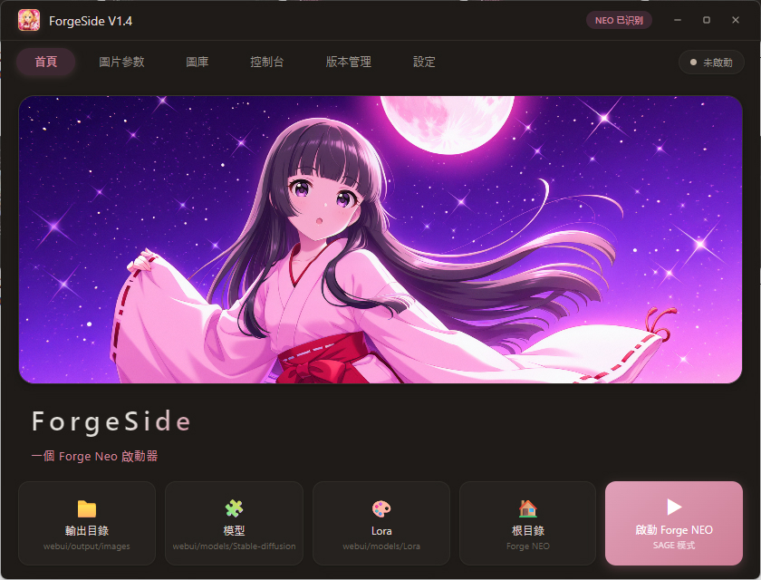
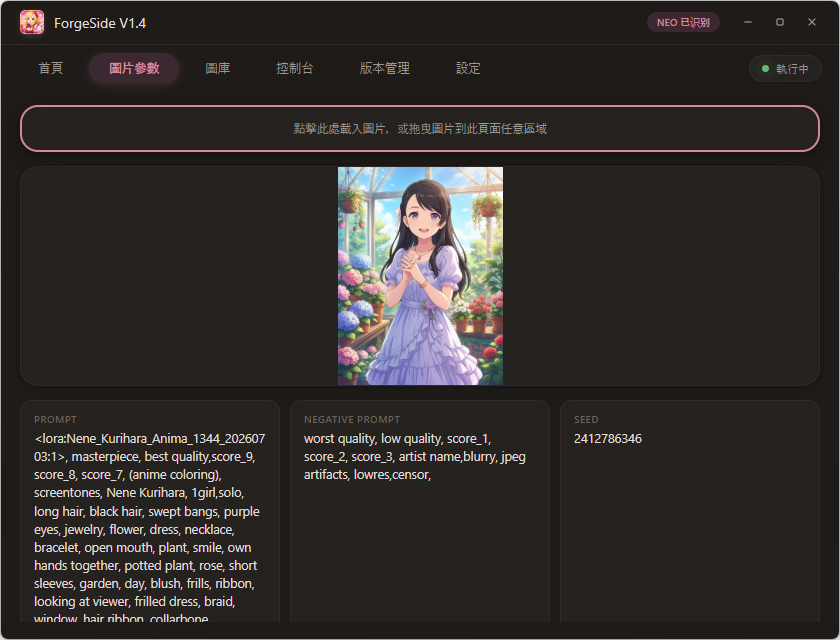
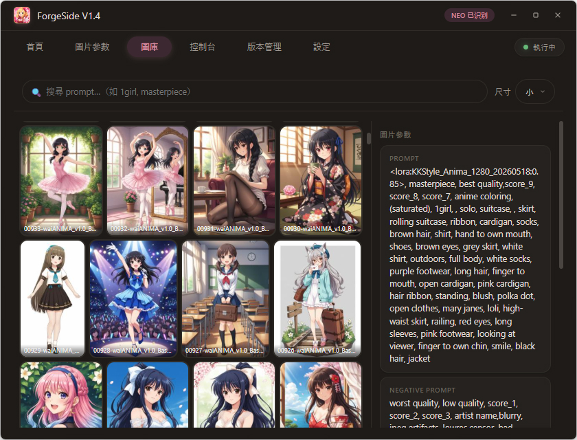
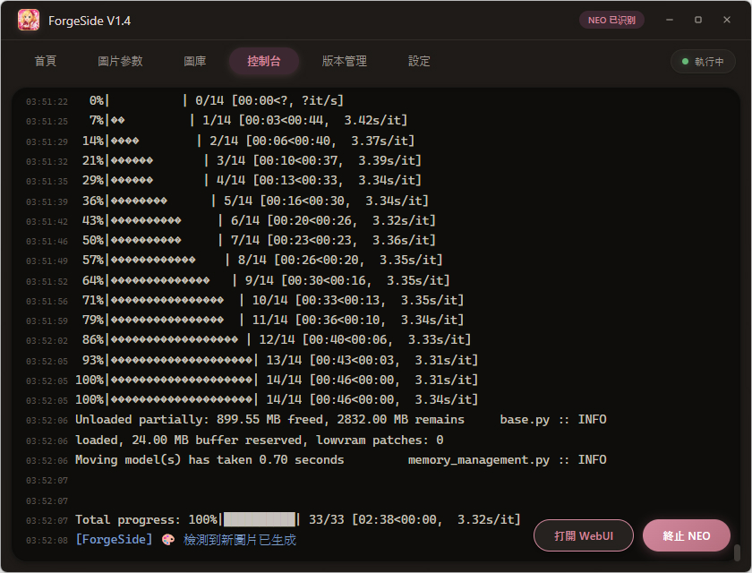
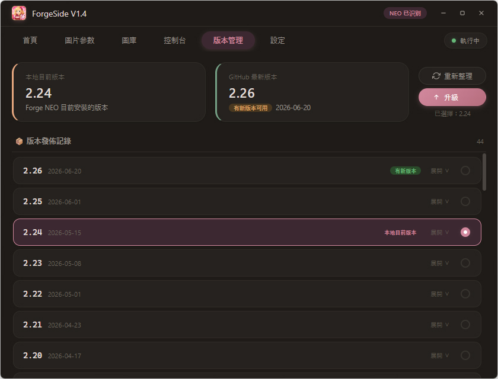
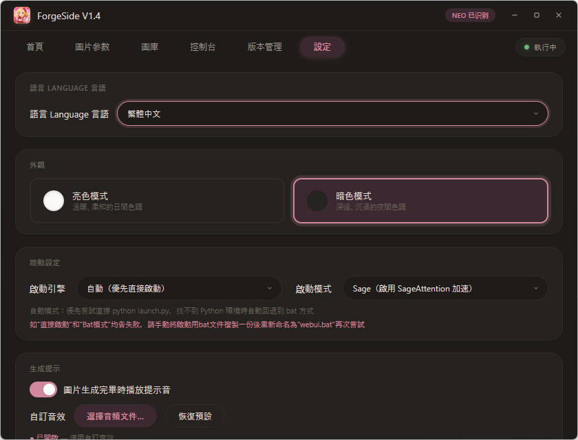
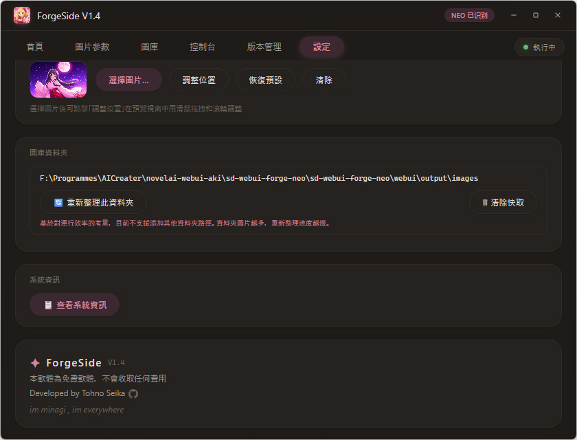

[🌏 English](README.md) | [简体中文](README.zh-CN.md) | **繁體中文** | [日本語](README.ja.md)

---

# ForgeSide ✨

> Forge NEO 的輔助啟動工具——漂亮、輕巧、順手。

一個 Windows 端 [Forge NEO](https://github.com/Haoming02/sd-webui-forge-classic/) 啟動器，提供圖形化介面來管理和啟動 Forge NEO，包含控制台輸出、圖片參數解析、圖庫瀏覽、版本管理等功能。支援[官方版 Forge NEO](https://github.com/Haoming02/sd-webui-forge-classic/)，理論上也支援基於[官方版 Forge NEO](https://github.com/Haoming02/sd-webui-forge-classic/)的第三方整合包。

<p style="color:#d2889e;">
本軟體目前支援 簡體中文・繁體中文・English・日本語 四種介面語言。
</p>

---

<p style="color:#d2889e;">
ForgeSide 僅支援啟動和管理 <a href="https://github.com/Haoming02/sd-webui-forge-classic/">Forge NEO</a>，不支援 ComfyUI / Forge / SD WebUI A1111 / Fooocus
</p>

---

## ✨ 特性

### 🚀 啟動與管理
- **一鍵啟動 Forge NEO** —— 無需手動輸入命令，點擊即可啟動
- **三種啟動模式** —— 支援 SDP 模式（相容性優先，停用加速）、Sage 模式（啟用 SageAttention 加速）、標準模式（僅啟動 webui.bat）
- **啟動方式程式碼已內置** —— 不再依賴外部腳本
- **行程守護** —— 執行時關閉視窗需要二次確認，防止誤關閉正在執行的 NEO 行程

### 🖥️ 即時控制台
- 啟動後自動擷取 Forge NEO 的輸出日誌，即時顯示在控制台面板
- 錯誤（Error / Traceback / CUDA OOM）自動高亮為紅色，警告為黃色，資訊為藍色
- 執行中可隨時一鍵「終止 NEO」或「開啟 WebUI」

### 🖼️ 圖片參數讀取
- 載入一張由 WebUI / Forge / ComfyUI 生成的 PNG 圖片
- 自動解析並展示：Prompt、Negative Prompt、Seed、Steps、CFG Scale、Sampler、Model、解析度等參數
- 支援點擊載入、拖放檔案、拖放 base64 三種方式
- 每個參數旁都有複製按鈕，方便快速複製

### 🗂️ 圖庫瀏覽
- 自動掃描 Forge NEO 輸出目錄下的 PNG 圖片
- 三檔縮圖尺寸（小/中/大），背景非同步生成，瞬間載入
- 支援多 tag 搜尋（用逗號分隔，順序無關），快速定位圖片
- 雙擊圖片用系統預設圖片檢視器開啟
- 支援從圖庫向外部（如資料夾、編輯器）拖出原圖
- 圖庫位置鎖定為 Forge NEO 輸出目錄，不支援自訂路徑

### 🎨 視覺與互動
- 粉色调柔和介面，深色/淺色主題一鍵切換
- 無邊框自訂視窗，支援拖拽、自由調整大小、最大化/還原
- 滑鼠滑過首頁橫幅時帶有櫻花飄落 Canvas 特效
- 視窗圓角、平滑動畫、優雅的過渡效果

### 📦 版本管理
- 自動檢測本地 Forge NEO 版本，從 GitHub 取得最新 Release 資訊
- 檢視版本發布記錄與更新說明
- 一鍵升級/切換/回退到指定版本（透過 Git tag）
- 同時支援第三方包版本（含 `webui/` 目錄）和[官方 GitHub 版](https://github.com/Haoming02/sd-webui-forge-classic/)

### 🌐 代理支援
- 內建 HTTP 代理設定，支援開關與自訂代理位址
- 一鍵測試 Google 和 Hugging Face 連通性，即時顯示延遲

### 🎵 生成提示音
- 圖片生成完畢時自動播放提示音
- 支援自訂音效檔案（.mp3 / .wav / .ogg / .flac 等）
- 可選擇恢復系統預設提示音

### 📋 系統資訊
- 一鍵檢視完整硬體配置
- 自動檢測 Python 版本與 Forge NEO 版本

### 🖼️ 背景圖自訂
- 首頁橫幅支援自訂背景圖片
- 可視化位置編輯器：滑鼠拖拽平移、滾輪縮放、十字線標記中心

---

## 🖼 截圖



*首頁 — 啟動入口、快捷資料夾、背景圖*



*圖片參數 — 拖入 PNG 自動解析生成資訊*



*圖庫 — 縮圖瀏覽、多 tag 搜尋*



*控制台 — 即時輸出日誌、啟動/終止 NEO*



*版本管理 — 檢視版本、Release 記錄、一鍵升級*



*設定 — 主題切換、啟動模式、代理、提示音等*



*關於 — 版本資訊、版權聲明*

---

## 📦 下載

### 測試人員

從 [Releases](https://github.com/TohnoSeika/ForgeSide/releases) 頁面下載最新版本的壓縮包。

### 系統需求

1. **作業系統**：僅支援 Windows 10 和 Windows 11（64 位元）
   - 不支援 Windows 7 / 8 / 8.1，不支援 Linux 和 macOS
2. **.NET 10 Desktop Runtime**（必須安裝）
   - 下載位址：https://dotnet.microsoft.com/download/dotnet/10.0
3. **WebView2 執行階段**（用於渲染程式介面）
   - Windows 11 自帶，無需額外安裝
   - Windows 10 可能需要手動安裝
   - 下載位址：https://developer.microsoft.com/zh-cn/microsoft-edge/webview2/

### 安裝步驟

1. 安裝 .NET 10 Desktop Runtime（如果已安裝請跳過）
2. 將 `ForgeSide` 資料夾完整解壓縮到 Forge NEO 根目錄下：

   **[官方版](https://github.com/Haoming02/sd-webui-forge-classic/)：**
   ```
   sd-webui-forge-neo/
   ├── models/
   ├── outputs/
   ├── webui.bat
   ├── webui-user.bat
   ├── ...（其他檔案）
   └── ForgeSide/          ← 解壓縮到這裡
       ├── ForgeSide.exe
       ├── forge_side_ui.html
       └── ...（其他檔案）
   ```

   **第三方整合包的參考結構：**
   ```
   sd-webui-forge-neo/
   ├── webui/
   ├── ...（其他檔案）
   └── ForgeSide/          ← 解壓縮到這裡
       ├── ForgeSide.exe
       ├── forge_side_ui.html
       └── ...（其他檔案）
   ```

3. 雙擊 `ForgeSide.exe` 即可執行


## 📋 更新記錄

### V1.4

- 🐛 解決了控制台亂碼的問題
- ⚡ 優化了 WebUI 啟動邏輯
- 🌍 軟體介面目前支援 简体中文・繁體中文・English・日本語 四種語言切換

### V1.3

- 🏗️ 增加了對 [Forge NEO 官方包](https://github.com/Haoming02/sd-webui-forge-classic/)（GitHub 版）的支援
- 📦 添加版本管理功能，可以從 GitHub 查看、升級和切換 Forge NEO 版本
- 🔒 鎖定圖庫位置為 Forge NEO 輸出資料夾，不再支援自訂圖庫資料夾
- 🖼️ 增加雙擊圖庫中圖片用預設圖片檢視器開啟
- 🖱️ 支援從圖庫向外部拖出原圖
- 🔍 優化圖庫多 tag 搜尋功能（逗號分隔、順序無關）
- ⚡ 啟動方式程式碼已由 ForgeSide 內置，不再依賴外部腳本
- 🌐 增加代理連線測試功能（Google / Hugging Face）
- 🖤 版權資訊中添加 GitHub 圖示連結

### V1.2

- 🪟 支援視窗大小自由可變，支援視窗最大化
- 📋 增加顯示電腦主要配置參數功能（CPU / GPU / 記憶體 / 磁碟 / 螢幕等）
- 🗂️ 增加圖庫功能（縮圖快取、搜尋、瀏覽）

### V1.1

- 🔒 增加正在執行時關閉視窗需要二次確認，避免誤關閉
- 🐛 修正第三方檔案管理員（如 XYplorer）開啟無效的問題
- 🐛 修正執行時在工作列點擊軟體不會最小化的問題
- 🌸 增加滑鼠滑過首頁圖時的櫻花特效
- 🐛 修正背景圖位置實際表現和選圖視窗不一致的問題
- 🎵 為生成音效增加當前音效完整檔案路徑顯示，並增加恢復預設音效按鈕

### V1.0

- 🎉 初版發布，實現 UI 和基礎啟動功能

---

## 🤖 AI 輔助聲明

本專案的部分程式碼及介面設計藉助 AI 輔助完成。

---

## 📜 許可證

本專案為 **免費軟體**，保留所有權利。  
詳情請參見 [LICENSE](./LICENSE) 檔案。

---

> 本軟體為免費軟體，不會收取任何費用。  
> Developed by Tohno Seika · [Bilibili](https://space.bilibili.com/14816) · [GitHub](https://github.com/TohnoSeika)
